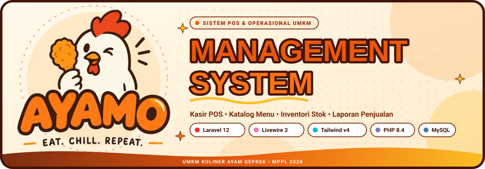
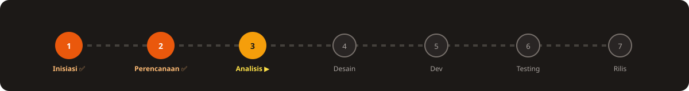

<div align="center">



<br>

[](#-tentang-proyek)
[](#%EF%B8%8F-technology-stack)
[](https://trello.com/invite/b/6ab62b128d44819f9f5248bf/ATTIe868d57bb29db6d9526ef84b8ddb2664AE14D58D/ayamo)
[](#-tim-pengembang)
[](#%EF%B8%8F-peta-level-proyek)
[](#-dokumen-proyek)
[](#%EF%B8%8F-cara-main-alur-kerja-tim)

<br>


**Merencanakan dan membangun ekosistem digital terintegrasi untuk UMKM Kuliner Ayamo: Point of Sale kasir, katalog menu dinamis, inventori bahan baku, dan laporan performa penjualan.**

</div>


<a id="tentang-proyek"></a>

## 🎮 Tentang Proyek

> 🎯 **MISI:** Membangun platform digital UMKM Ayamo untuk mempercepat transaksi kasir, mengelola katalog produk secara terpusat, memantau pergerakan stok harian, dan menghasilkan laporan analitik penjualan secara real-time.
> 🕹️ **STUDI KASUS:** UMKM Kuliner Ayamo (_Eat Chill Repeat_).
> 🏁 **STAGE SAAT INI:** Tahap Inisiasi & Perencanaan selesai, sedang berjalan pada tahap Analisis Kebutuhan & Perancangan Sistem.

**Ayamo** adalah UMKM kuliner yang menyajikan berbagai olahan ayam geprek, ayam krispi, paket nasi, serta aneka minuman segar. Seiring bertambahnya variasi pesanan dan volume transaksi, diperlukan sistem kasir dan operasional yang andal, responsif, dan mudah digunakan langsung dari meja kasir maupun perangkat seluler.

| Kondisi Saat Ini                                          | Kebutuhan Utama                                         | Solusi Digital Ayamo                             |
| --------------------------------------------------------- | ------------------------------------------------------- | ------------------------------------------------ |
| Pencatatan pesanan manual & rawan antrean panjang         | Kasir cepat, kalkulasi otomatis, dan cetak/simpan struk | Modul Kasir POS Responsif berbasis Livewire Volt |
| Pembaruan harga & menu belum tersentralisasi              | Manajemen katalog menu, varian, dan level pedas         | Panel Manajemen Produk & Kategori Dinamis        |
| Pemantauan bahan baku (ayam, cabai, minyak) belum presisi | Peringatan stok menipis & riwayat stok masuk/keluar     | Modul Inventori & Pelacak Stok Bahan Baku        |
| Rekap omzet harian memakan waktu                          | Laporan transaksi instan dan grafik penjualan           | Dashboard Laporan Penjualan & Performa Harian    |

<details>
<summary><b>🧺 Contoh Katalog Produk & Varian Ayamo (Klik untuk membuka)</b></summary>

<br>

| Kategori             | Item Produk                | Varian / Catatan                   |
| -------------------- | -------------------------- | ---------------------------------- |
| 🍗 **Ayam & Paket**  | Paket Ayam Geprek Ayamo    | Level Pedas 1–5, Pilihan Sambal    |
| 🍗 **Ayam & Paket**  | Paket Ayam Crispy Original | Saus Keju / BBQ / Saus Pedas Manis |
| 🍗 **Ayam & Paket**  | Paket Ayam Bakar Madu      | Nasi + Lalapan + Sambal Terasi     |
| 🍟 **Sides & Snack** | Kulit Ayam Krispi          | Original / Balado / Spicy          |
| 🍟 **Sides & Snack** | Tahu & Tempe Geprek        | Pilihan Sambal Bawang / Ijo        |
| 🍹 **Minuman**       | Es Teh Manis / Lemon Tea   | Regular / Jumbo                    |
| 🍹 **Minuman**       | Aneka Jus Buah Segar       | Mangga, Alpukat, Jeruk             |

</details>


<a id="technology-stack"></a>

## 🛠️ Technology Stack

<div align="center">


<br><br>

| Lapisan Arsitektur       | Teknologi                                                                                     | Keterangan & Peran                                                    |
| ------------------------ | --------------------------------------------------------------------------------------------- | --------------------------------------------------------------------- |
| **Backend Framework**    | [Laravel v12](https://laravel.com/)                                                           | Kerangka kerja PHP modern untuk business logic, routing, dan security |
| **Runtime Engine**       | PHP 8.4+                                                                                      | Typed properties, performa tinggi, dan fitur sintaks modern           |
| **Frontend Reactive**    | [Livewire v3](https://livewire.laravel.com/) & [Volt](https://livewire.laravel.com/docs/volt) | Komponen UI reaktif single-file tanpa API boilerplate terpisah        |
| **UI Component Kit**     | [Livewire Flux](https://flux.livewire.com/)                                                   | Desain sistem komponen siap pakai yang selaras dengan Tailwind        |
| **Styling Engine**       | [Tailwind CSS v4](https://tailwindcss.com/) & Vite                                            | Utility-first CSS engine super cepat dan teroptimasi                  |
| **Client Interactivity** | Alpine.js                                                                                     | Micro-interactions, dropdown, modal state sisi klien                  |
| **Database**             | MySQL / MariaDB                                                                               | Penyimpanan data relasional transaksional ACID compliant              |
| **Dev & Collab Tools**   | Git, GitHub, VSCode, Trello, Docker                                                           | Manajemen source code, pelacakan tugas, dan standarisasi workspace    |

</div>


<a id="trello-workspace"></a>

## 📋 Manajemen Proyek & Workspace Trello

Untuk menjaga transparansi tugas, sprint, dan kolaborasi antar anggota tim, seluruh backlog dan aktivitas pengembangan dikelola melalui Trello Board resmi proyek:

<div align="center">

[](https://trello.com/invite/b/6ab62b128d44819f9f5248bf/ATTIe868d57bb29db6d9526ef84b8ddb2664AE14D58D/ayamo)

**🔗 Link Undangan Workspace Trello:**
[https://trello.com/invite/b/6ab62b128d44819f9f5248bf/ATTIe868d57bb29db6d9526ef84b8ddb2664AE14D58D/ayamo](https://trello.com/invite/b/6ab62b128d44819f9f5248bf/ATTIe868d57bb29db6d9526ef84b8ddb2664AE14D58D/ayamo)

</div>

| List Trello                   | Deskripsi Aktivitas                                                            |
| ----------------------------- | ------------------------------------------------------------------------------ |
| 📌 **Project Backlog**        | Kumpulan seluruh kebutuhan fitur, perbaikan, dan riset yang akan dikerjakan    |
| 📝 **To Do / Sprint Backlog** | Tugas yang diprioritaskan pada iterasi/minggu yang sedang berjalan             |
| ⏳ **In Progress**            | Tugas yang sedang aktif dikerjakan oleh anggota tim penanggung jawab           |
| 🔍 **Review / Testing**       | Pengujian fungsionalitas, validasi input, dan pengecekan kode sebelum digabung |
| ✅ **Done**                   | Fitur dan dokumentasi yang telah selesai, diverifikasi, dan siap digunakan     |


<a id="tim-pengembang"></a>

## 👥 Tim Pengembang & Manajemen Proyek

<div align="center">


<br><br>


<br><br>

</div>

| No  | Nama Lengkap                     |     NIM     | GitHub                                                           | Peran Utama & Tanggung Jawab                                                                          |
| :-: | -------------------------------- | :---------: | ---------------------------------------------------------------- | ----------------------------------------------------------------------------------------------------- |
|  1  | **Ruhmita 1**                    | `230504012` | [`@rumiyeoon`](https://github.com/rumiyeoon)                     | **Project Manager & Backend Lead**<br>Inisiasi proyek, arsitektur database, dan validasi sistem       |
|  2  | **Fazah Fatahillah**             | `230504014` | [`@rizput1009`](https://github.com/rizput1009)                   | **Frontend & UI/UX Specialist**<br>Perancangan antarmuka POS, komponen Livewire Volt & Flux           |
|  3  | **Muhammad Rifki Aulia Pratama** | `230504089` | [`@mrifkiauliap`](https://github.com/mrifkiauliap)               | **Business Analyst & Content Lead**<br>Analisis kebutuhan UMKM, pemetaan menu/stok, dan presentasi    |
|  4  | **Rafi Alamsyah**                | `230504024` | [`@rafialamsyah720-eng`](https://github.com/rafialamsyah720-eng) | **QA Tester & Technical Writer**<br>Skenario pengujian, dokumentasi repositori, dan pengelolaan rilis |

> 💡 _Foto bersama seluruh anggota tim dapat disimpan di folder [`assets/anggota/tim.png`](/assets/anggota)._


<a id="peta-level-proyek"></a>

## 🗺️ Peta Level Proyek (Tahapan MPPL)

<div align="center">

</div>

Klik pada masing-masing level untuk meninjau rincian pekerjaan:

<details>
<summary><b>⭐ LEVEL 1 — Inisiasi Proyek</b> &nbsp; ✅ Selesai</summary>

<br>

- **1.1** Penentuan studi kasus UMKM Kuliner (Ayamo).
- **1.2** Wawancara awal dan observasi kebutuhan operasional kasir & stok.
- **1.3** Penyusunan Project Charter dan batas ruang lingkup proyek.
- **1.4** Identifikasi pemangku kepentingan (Stakeholder Register).

📄 Terkait: [`docs/SURVEY/Project Charter.docx`](/docs/SURVEY/Project%20Charter.docx) · [`docs/SURVEY/Stakeholder Register.docx`](/docs/SURVEY/Stakeholder%20Register.docx)

</details>

<details>
<summary><b>⭐ LEVEL 2 — Perencanaan & Setup Repositori</b> &nbsp; ✅ Selesai</summary>

<br>

- **2.1** Penyusunan Work Breakdown Structure (WBS) menyeluruh.
- **2.2** Pembagian peran, deskripsi tugas, dan estimasi waktu kerja.
- **2.3** Penyiapan workspace Trello, Git workflow, dan arsitektur repositori.
- **2.4** Inisialisasi struktur starter kit Laravel 12, Livewire Volt, dan Tailwind CSS v4.

📄 Terkait: [`docs/SURVEY/WBS.docx`](/docs/SURVEY/WBS.docx) · [`plan/25-09-26-init.md`](/plan/25-09-26-init.md)

</details>

<details>
<summary><b>🔹 LEVEL 3 — Analisis Kebutuhan Sistem</b> &nbsp; ▶ Sedang Berjalan</summary>

<br>

- **3.1** Inventarisasi data master menu, harga jual, bahan baku, dan varian.
- **3.2** Penyusunan kebutuhan fungsional (FR) dan non-fungsional (NFR).
- **3.3** Perancangan use case diagram dan alur proses bisnis kasir/owner.

📄 Terkait: [`docs/features-and-modules.md`](/docs/features-and-modules.md)

</details>

<details>
<summary><b>🔒 LEVEL 4 — Perancangan (Design & Architecture)</b></summary>

<br>

- **4.1** Desain skema basis data relasional (ERD) dan integritas tabel.
- **4.2** Perancangan UI/UX antarmuka kasir (POS) dan panel admin dashboard.
- **4.3** Penetapan standarisasi penanganan error UI & komponen Blade/Volt.

📄 Terkait: [`docs/architecture.md`](/docs/architecture.md) · [`docs/standards-and-conventions.md`](/docs/standards-and-conventions.md)

</details>

<details>
<summary><b>🔒 LEVEL 5 — Pengembangan Aplikasi (Implementation)</b></summary>

<br>

- **5.1** Implementasi migrasi, model Eloquent, seeder data master.
- **5.2** Pengembangan modul Kasir Point of Sale (POS) cepat dengan Livewire Volt.
- **5.3** Pengembangan modul manajemen produk, kategori, dan stok bahan.
- **5.4** Pengembangan modul laporan transaksi dan rekap pendapatan.

</details>

<details>
<summary><b>🔒 LEVEL 6 — Pengujian Sistem (Testing & QA)</b></summary>

<br>

- **6.1** Penyusunan test scenario (validasi input kasir, transaksi gagal/berhasil).
- **6.2** Pengujian responsivitas UI pada perangkat desktop kasir dan tablet.
- **6.3** Uji coba transaksi langsung dan penyesuaian masukan pengguna.

</details>

<details>
<summary><b>🔒 LEVEL 7 — Dokumentasi Akhir & Rilis</b></summary>

<br>

- **7.1** Finalisasi buku panduan pengguna (User Guide).
- **7.2** Penyusunan laporan akhir Manajemen Proyek Perangkat Lunak (MPPL).
- **7.3** Presentasi demonstrasi sistem dan serah terima hasil proyek.

</details>

### 📊 Ringkasan Progres Proyek

- [x] **Level 1 — Inisiasi:** Ide proyek, latar belakang UMKM, Project Charter, Stakeholder Register
- [x] **Level 2 — Perencanaan:** Struktur WBS, setup Git & Trello Workspace, inisialisasi TAILL Stack
- [ ] **Level 3 — Analisis Kebutuhan:** Spesifikasi modul, inventarisasi menu & alur kasir
- [ ] **Level 4 — Perancangan:** Skema database final, mockup UI Flux, konvensi error modal
- [ ] **Level 5 — Pengembangan:** Implementasi fitur POS, manajemen inventori, dan analitik
- [ ] **Level 6 — Pengujian:** Testing skenario kasir, perbaikan bug, validasi owner
- [ ] **Level 7 — Dokumentasi & Rilis:** Laporan akhir MPPL, video demo, dan penutupan proyek


<a id="dokumen-proyek"></a>

## 🎒 Dokumen & Spesifikasi Proyek

Seluruh dokumentasi teknis dan manajemen proyek disusun secara modular dan terstruktur:

| No  | Dokumen                       | Lokasi Berkas                                                             | Fokus Pembahasan                                | Status |
| :-: | ----------------------------- | ------------------------------------------------------------------------- | ----------------------------------------------- | :----: |
|  1  | **Indeks Dokumentasi**        | [`docs/README.md`](/docs/README.md)                                       | Gambaran umum seluruh dokumen sistem            |   ✅   |
|  2  | **Arsitektur Sistem**         | [`docs/architecture.md`](/docs/architecture.md)                           | TAILL Stack, relasi data, & alur kerja komponen |   ✅   |
|  3  | **Standar & Konvensi**        | [`docs/standards-and-conventions.md`](/docs/standards-and-conventions.md) | Pedoman error handling, penamaan, & validasi    |   ✅   |
|  4  | **Spesifikasi Modul & Fitur** | [`docs/features-and-modules.md`](/docs/features-and-modules.md)           | Rincian modul POS, inventori, laporan, & user   |   ✅   |
|  5  | **Roadmap Pengembangan**      | [`plan/roadmap-umkm-ayamo.md`](/plan/roadmap-umkm-ayamo.md)               | Roadmap tahapan sprint & deliverables           |   ✅   |
|  6  | **Inisialisasi Proyek**       | [`plan/25-09-26-init.md`](/plan/25-09-26-init.md)                         | Catatan ketetapan awal techstack & integrasi    |   ✅   |

<details>
<summary><b>📁 Struktur Direktori Repositori</b></summary>

```text
ayamo/
├── app/                  # Direktori sumber aplikasi Laravel
│   ├── app/              # Model, Controller, Provider, Livewire components
│   ├── database/         # Migrations, Seeders, Factories
│   ├── resources/        # Views (Blade, Volt, Flux), CSS, JS
│   ├── routes/           # Routing web & auth
│   └── vite.config.js    # Konfigurasi bundler frontend
├── assets/               # Aset visual & dokumentasi grafis
│   ├── banner.svg        # Banner vektor repositori
│   ├── divider.svg       # Pembatas dekoratif
│   ├── footer.svg        # Footer vektor
│   ├── levels.svg        # Roadmap level visual
│   ├── team.svg          # Header tim pengembang
│   ├── logo.webp         # Logo resmi Ayamo
│   └── anggota/          # Foto profil anggota tim
├── docs/                 # Dokumentasi sistem & laporan MPPL
│   ├── architecture.md   # Arsitektur sistem & alur data
│   ├── features-and-modules.md  # Spesifikasi modul fitur
│   ├── standards-and-conventions.md # Pedoman koding & validasi
│   └── SURVEY/           # Dokumen survei, Charter, WBS, Stakeholder
├── plan/                 # Rencana kerja & sprint backlog
│   ├── 25-09-26-init.md  # Inisialisasi arsitektur awal
│   └── roadmap-umkm-ayamo.md # Roadmap implementasi bertahap
└── README.md             # Dokumentasi utama repositori
```

</details>


<a id="cara-main-alur-kerja-tim"></a>

## 🕹️ Cara Main (Alur Kerja Tim di Repositori Ini)

Untuk menjaga kebersihan riwayat git dan mencegah konflik kode, seluruh anggota tim mengikuti alur kerja standar berikut:

<details>
<summary><b>🔧 Prosedur Kerja Git & Pull Request (Klik untuk membaca)</b></summary>

<br>

1. **Sinkronisasi Terlebih Dahulu**:
   ```bash
   git checkout main
   git pull origin main
   ```
2. **Buat Branch Khusus untuk Tugas/Fitur Baru**:
   Gunakan format penamaan `fitur/nama-fitur` atau `docs/nama-dokumen`:
   ```bash
   git checkout -b fitur/kasir-pos-order
   ```
3. **Kerjakan & Commit dengan Pesan yang Jelas**:
   ```bash
   git add .
   git commit -m "feat(pos): tambah komponen keranjang belanja dan kalkulasi total"
   ```
4. **Kirim Perubahan ke GitHub**:
   ```bash
   git push -u origin fitur/kasir-pos-order
   ```
5. **Buka Pull Request (PR)** di GitHub menuju branch `main`. Diskusikan dan lakukan peninjauan kode (_code review_) sebelum digabungkan.

</details>

<details>
<summary><b>📜 Tabel Contekan Perintah Git yang Sering Digunakan</b></summary>

<br>

| Perintah Git               | Fungsi & Kegunaan                                             |
| -------------------------- | ------------------------------------------------------------- |
| `git clone <url>`          | Mengunduh repositori proyek ke lokal                          |
| `git status`               | Memeriksa berkas yang telah diubah atau belum terdeteksi      |
| `git add .`                | Menandai seluruh perubahan untuk disimpan ke staging          |
| `git commit -m "pesan"`    | Menyimpan riwayat perubahan dengan deskripsi ringkas          |
| `git pull origin main`     | Mengambil dan menggabungkan pembaruan terbaru dari server     |
| `git push origin <branch>` | Mengunggah branch lokal ke repositori GitHub                  |
| `git checkout -b <branch>` | Membuat branch baru dan langsung berpindah ke branch tersebut |
| `git log --oneline -n 5`   | Melihat riwayat 5 commit terakhir secara ringkas              |

</details>


<a id="panduan-instalasi"></a>

## ⚙️ Panduan Instalasi & Menjalankan Aplikasi

### 1. Prasyarat Sistem

- **PHP** `>= 8.2` (Sangat disarankan **PHP 8.4+**)
- **Composer** `>= 2.7`
- **Node.js** `>= 20.x` & **NPM**
- **MySQL** / **MariaDB** Server

### 2. Kloning Repositori & Persiapan Environment

Masuk ke direktori aplikasi `app/`:

```bash
cd app
cp .env.example .env
```

Sesuaikan kredensial basis data pada file `.env`:

```env
APP_NAME="Ayamo - Eat Chill Repeat"
APP_URL=http://localhost:8000

DB_CONNECTION=mysql
DB_HOST=127.0.0.1
DB_PORT=3306
DB_DATABASE=ayamo_db
DB_USERNAME=root
DB_PASSWORD=
```

### 3. Instalasi Dependensi & Database

```bash
composer install
npm install
php artisan key:generate
php artisan migrate
```

### 4. Menjalankan Server Pengembangan

Jalankan service secara bersamaan (Server Laravel, Queue, Pail log, dan Vite):

```bash
composer run dev
```

Akses aplikasi melalui peramban: `http://localhost:8000` (atau port yang tertera pada konsol).


<a id="standar-dan-konvensi"></a>

## ⚖️ Konvensi Koding & Penanganan Error

Seluruh pengembangan fitur wajib mematuhi panduan pada [Standar & Konvensi](/docs/standards-and-conventions.md):

1. **Penanganan Error Validasi**:
   - Untuk input form spesifik: Wajib memakai `<x-input-error :messages="$errors->get('field')" />` tepat di bawah field input terkait.
   - Untuk error global/transaksional non-field: Wajib memakai `<x-modal-notification>` yang dipicu oleh session flash message (`session()->flash('error', '...')`).
2. **Penamaan Berkas**:
   - View Blade & Livewire Volt: `kebab-case` (contoh: `order-cart-panel.blade.php`, `menu-item-card.blade.php`).
   - Class PHP & Model: `PascalCase` (contoh: `OrderController.php`, `MenuItem.php`).
3. **Integritas Skema**:
   - Dilarang membuat skema tanpa relasi atau logika yang tidak jelas (_No AI Slop_). Seluruh migrasi dan seeder harus terstruktur sesuai kebutuhan bisnis nyata UMKM Ayamo.

<br>

<div align="center">


**🍗 AYAMO — EAT • CHILL • REPEAT**
Tugas Manajemen Proyek Perangkat Lunak (MPPL) · 2026

</div>
