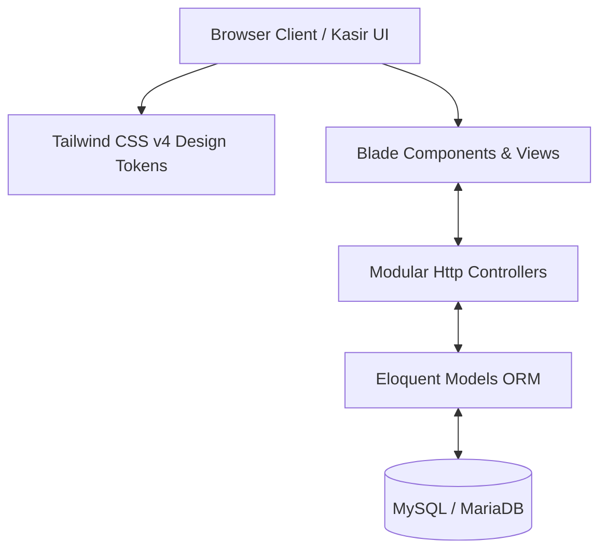

# 🏗️ Arsitektur Sistem Ayamo

Dokumen ini menjelaskan fondasi arsitektur, tumpukan teknologi (tech stack), serta alur kerja teknis aplikasi web **Ayamo**.

---

## 1. Tumpukan Teknologi (Tech Stack)

Sistem Ayamo memanfaatkan arsitektur modern berbasis Laravel 12 dan Tailwind CSS:



### Rincian Komponen:
1. **Laravel 12 (Core Backend)**
   - Mengatur alur bisnis, routing modular, validasi request, sesi admin, dan interaksi basis data Eloquent ORM.
   - Menggunakan PHP 8.4+ dengan fitur tipe data ketat (*strict types* & *constructor property promotion*).
2. **Modular Controllers**
   - Pemisahan tanggung jawab controller per domain fungsional:
     - `ShopController`: Katalog etalase publik, session cart, dan checkout pesanan.
     - `Admin\AuthController`: Otentikasi login/logout admin & proteksi brute-force.
     - `Admin\DashboardController`: Metrik omzet penjualan, grafik analitik, produk terlaris.
     - `Admin\OrderController`: Konfirmasi pesanan & alokasi stok otomatis.
     - `Admin\ProductController`: CRUD katalog produk & pengarsipan.
     - `Admin\TransactionController`: Pencatatan transaksi kasir manual langsung di dashboard.
3. **Eloquent ORM Models**
   - `Product`: Master produk, harga, stok, dan helper seeding default.
   - `Order`: Pesanan pelanggan online dengan payload item JSON.
   - `Transaction`: Rekap mutasi transaksi penjualan terkonfirmasi.
   - `LoginAttempt`: Pelacakan percobaan login gagal & lockout throttle.
   - `User`: Model pengguna/admin aplikasi.
4. **Tailwind CSS v4 & Theme Design System**
   - Mesin styling modern menggunakan variabel CSS dan `@theme` dengan token warna kuliner warm appetizing (*Gold, Orange, Sand, Green, Red, Sky*), dark mode switcher, serta badge level kepedasan (*Spice Level*).
5. **MySQL / MariaDB**
   - Basis data relasional penyimpan data pengguna, katalog menu, pesanan, detail transaksi kasir, dan riwayat stok.

---

## 2. Struktur Modul Aplikasi (`app/`)

```text
app/
├── app/
│   ├── Http/
│   │   ├── Controllers/
│   │   │   ├── Admin/
│   │   │   │   ├── AuthController.php          # Login, logout, lockout throttle
│   │   │   │   ├── DashboardController.php     # Metrik omzet, grafik & best seller
│   │   │   │   ├── OrderController.php         # Konfirmasi pesanan & update stok
│   │   │   │   ├── ProductController.php       # Simpan & arsipkan produk
│   │   │   │   └── TransactionController.php   # Catat transaksi kasir manual
│   │   │   ├── Controller.php                  # Base controller abstrak
│   │   │   └── ShopController.php              # Etalase, keranjang, & checkout
│   │   └── Requests/                           # Request validation
│   ├── Models/
│   │   ├── LoginAttempt.php                    # Model pelacak login lockout
│   │   ├── Order.php                           # Model pesanan pelanggan
│   │   ├── Product.php                         # Model katalog produk & stok
│   │   ├── Transaction.php                     # Model mutasi transaksi
│   │   └── User.php                            # Model akun user
│   └── Providers/                              # Service providers
├── database/
│   ├── factories/                              # Model factories untuk testing
│   ├── migrations/                             # Skema tabel database
│   └── seeders/                                # Data awal (seeder menu, admin, dsb.)
├── resources/
│   ├── css/
│   │   └── app.css                             # Setup Tailwind CSS v4 & theme tokens
│   ├── js/
│   │   └── app.js                              # Inisialisasi script frontend
│   └── views/
│       ├── admin/                              # View panel admin (dashboard, login, forms)
│       ├── components/                         # Reusable Blade components (<x-input-error>, dll.)
│       ├── layouts/                            # Layout template (app, guest)
│       └── shop.blade.php                      # Halaman etalase toko & keranjang
└── routes/
    └── web.php                                 # Routing publik & middleware admin
```

---

## 3. Pola Interaksi Data & State Management

### A. Alur Pemesanan Online (Customer Journey)
1. **Etalase Menu**: Pelanggan memilih menu dari `ShopController@shop`.
2. **Keranjang Belanja**: Disimpan dalam session `cart` melalui `ShopController@addToCart` dan `updateCart`.
3. **Checkout Transaksi**: `ShopController@checkout` memvalidasi ketersediaan stok menggunakan `DB::transaction()` dan `lockForUpdate()`, lalu membuat entitas `Order`.

### B. Alur Manajemen Admin
1. **Otentikasi & Keamanan**: Admin login diverifikasi terhadap hash password dengan batasan percobaan gagal (maks. 5 kali sebelum lockout 15 menit).
2. **Konfirmasi Pesanan**: `Admin\OrderController@confirm` mengunci record order, mengurangi stok pada model `Product`, dan mencatat record baru pada `Transaction`.
3. **Penjualan Kasir Manual**: `Admin\TransactionController@manualSale` mencatat penjualan langsung dan memotong stok seketika dalam satu transaksi atomik.

---

## 4. Keamanan & Performa

1. **Proteksi Akses**: Menggunakan middleware session admin khusus (`admin.session`) dan pembatasan throttle pada rute login (`throttle:10,1`).
2. **Integritas Konkurensi Stok**: Menggunakan *Pessimistic Locking* (`lockForUpdate()`) di dalam database transaction agar tidak terjadi *overselling* saat banyak pesanan bersamaan.
3. **CSRF & XSS Protection**: Seluruh form web dilindungi token CSRF otomatis (`@csrf`) dan Blade escaping.
