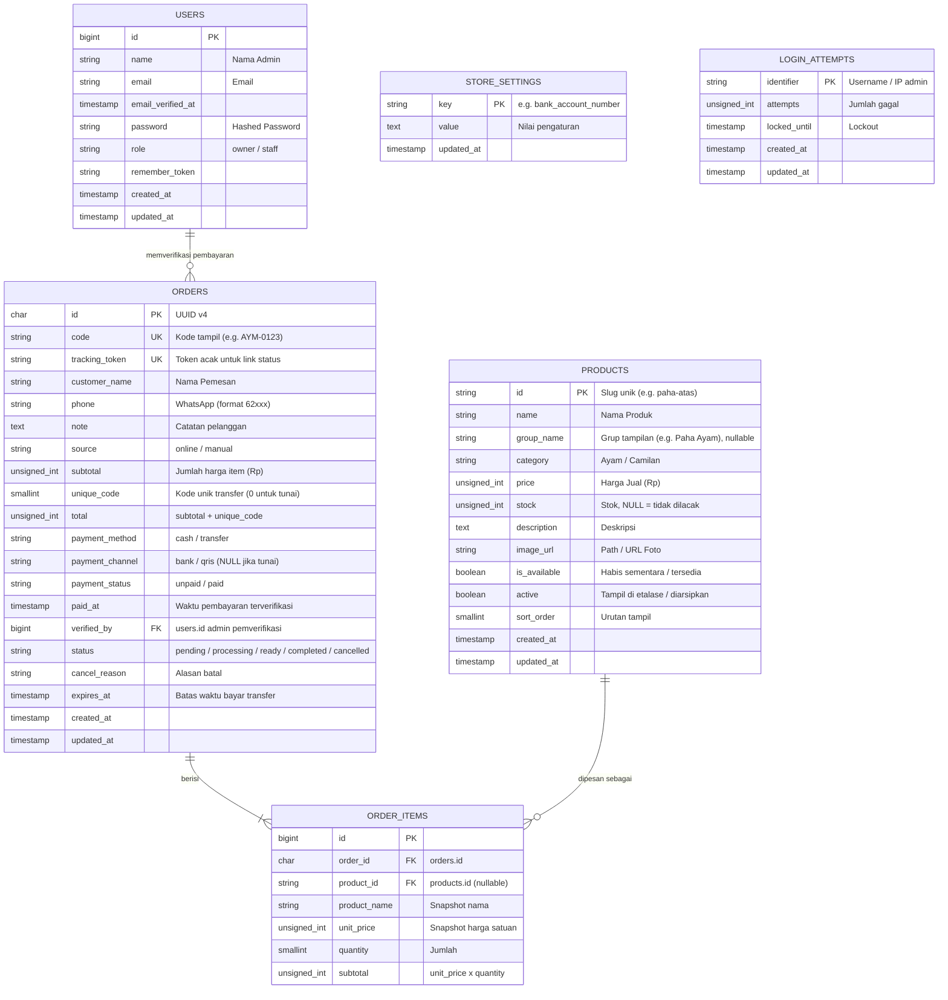
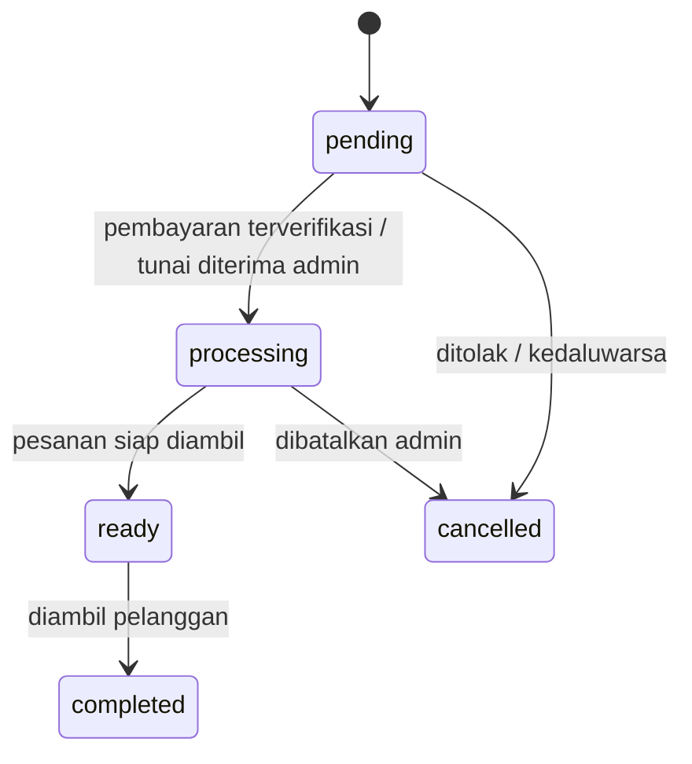

# 🗄️ Skema Basis Data (Database Schema) Sistem Ayamo — v2

Dokumen ini adalah revisi skema basis data Ayamo untuk alur baru: **pelanggan tanpa login**, pembayaran **Tunai / Transfer (Bank & QRIS statis)** yang diverifikasi lewat WhatsApp, dan **aplikasi admin terpisah** (lihat penjualan + CRUD menu) yang memakai database yang sama.

---

## 1. Diagram Relasi Entitas (ERD)

---

## 2. Rincian Skema Tabel

### A. Tabel `products`
Katalog menu. Menu awal ada 6 item; **Paha Ayam dipisah jadi 2 baris** (Atas & Bawah) supaya stok dan harga masing-masing bisa diatur sendiri.

| Kolom | Tipe Data | Nullable | Keterangan |
| :--- | :--- | :--- | :--- |
| `id` | `VARCHAR(100)` | No | Primary Key (slug, misal `paha-atas`) |
| `name` | `VARCHAR(255)` | No | Nama item (misal *Paha Atas*) |
| `group_name` | `VARCHAR(255)` | Yes | Untuk menggabungkan varian di UI (misal *Paha Ayam*) |
| `category` | `VARCHAR(50)` | No | `Ayam` atau `Camilan` |
| `price` | `INT UNSIGNED` | No | Harga dalam Rupiah |
| `stock` | `INT UNSIGNED` | Yes | Sisa stok; `NULL` = tidak dilacak |
| `description` | `TEXT` | Yes | Deskripsi rasa/isi |
| `image_url` | `VARCHAR(255)` | Yes | Path foto |
| `is_available` | `BOOLEAN` | No | `false` = tampil tapi tombol pesan nonaktif (habis sementara), default `true` |
| `active` | `BOOLEAN` | No | `false` = diarsipkan (tidak tampil), default `true` |
| `sort_order` | `SMALLINT` | No | Urutan tampil, default `0` |
| `created_at` / `updated_at` | `TIMESTAMP` | Yes | Audit waktu |

*Indeks:* `(active, category, sort_order)` untuk query etalase.

**Seed menu awal**

| id | name | group_name | category | price |
| :--- | :--- | :--- | :--- | :--- |
| `dada` | Dada Ayam | — | Ayam | 18000 |
| `sayap` | Sayap Ayam | — | Ayam | *(isi)* |
| `paha-atas` | Paha Atas | Paha Ayam | Ayam | 16000 |
| `paha-bawah` | Paha Bawah | Paha Ayam | Ayam | *(isi)* |
| `ceker` | Ceker Ayam | — | Ayam | *(isi)* |
| `hati` | Hati Ayam | — | Ayam | *(isi)* |
| `bakso-goreng-stick` | Bakso Goreng Stick | — | Camilan | 12000 |

---

### B. Tabel `orders`
Satu baris per pesanan dari pelanggan (online) atau diinput admin (manual/walk-in). **Status pesanan dan status pembayaran dipisah** karena siklusnya beda.

| Kolom | Tipe Data | Nullable | Keterangan |
| :--- | :--- | :--- | :--- |
| `id` | `CHAR(36)` | No | Primary Key (UUID v4) |
| `code` | `VARCHAR(20)` | No | **Unique.** Kode pendek untuk kasir/WA (misal `AYM-0123`) |
| `tracking_token` | `VARCHAR(32)` | No | **Unique.** Token acak untuk link status pelanggan |
| `customer_name` | `VARCHAR(255)` | No | Nama pemesan |
| `phone` | `VARCHAR(20)` | No | WhatsApp, disimpan format `62xxxxxxxxxx` |
| `note` | `TEXT` | Yes | Catatan pelanggan |
| `source` | `VARCHAR(20)` | No | `online` / `manual`, default `online` |
| `subtotal` | `INT UNSIGNED` | No | Total harga item |
| `unique_code` | `SMALLINT UNSIGNED` | No | Kode unik transfer 1–999; `0` untuk tunai |
| `total` | `INT UNSIGNED` | No | `subtotal + unique_code`, nominal yang harus dibayar |
| `payment_method` | `VARCHAR(20)` | No | `cash` / `transfer` |
| `payment_channel` | `VARCHAR(20)` | Yes | `bank` / `qris`; `NULL` jika tunai |
| `payment_status` | `VARCHAR(20)` | No | `unpaid` / `paid`, default `unpaid` |
| `paid_at` | `TIMESTAMP` | Yes | Saat admin memverifikasi / kasir menerima uang |
| `verified_by` | `BIGINT UNSIGNED` | Yes | FK `users.id` (admin yang memverifikasi) |
| `status` | `VARCHAR(20)` | No | `pending` → `processing` → `ready` → `completed`, atau `cancelled` |
| `cancel_reason` | `VARCHAR(255)` | Yes | Alasan pembatalan |
| `expires_at` | `TIMESTAMP` | Yes | Batas bayar untuk transfer; lewat batas → otomatis `cancelled` |
| `created_at` / `updated_at` | `TIMESTAMP` | Yes | Audit waktu |

*Indeks:* `(status, created_at)` untuk antrean dashboard, `(payment_status, paid_at)` untuk laporan penjualan, `(phone)` untuk pencarian.

**Alur status**

---

### C. Tabel `order_items`
Menggantikan kolom JSON `items` pada skema lama, supaya laporan "menu terlaris" cukup satu query `GROUP BY`.

| Kolom | Tipe Data | Nullable | Keterangan |
| :--- | :--- | :--- | :--- |
| `id` | `BIGINT UNSIGNED` | No | Primary Key (auto increment) |
| `order_id` | `CHAR(36)` | No | FK `orders.id`, `ON DELETE CASCADE` |
| `product_id` | `VARCHAR(100)` | Yes | FK `products.id`, `ON DELETE SET NULL` |
| `product_name` | `VARCHAR(255)` | No | **Snapshot** nama saat dipesan |
| `unit_price` | `INT UNSIGNED` | No | **Snapshot** harga satuan saat dipesan |
| `quantity` | `SMALLINT UNSIGNED` | No | Jumlah |
| `subtotal` | `INT UNSIGNED` | No | `unit_price × quantity` |

*Indeks:* `(order_id)`, `(product_id)`.

---

### D. Tabel `store_settings`
Pengaturan toko yang diedit dari aplikasi admin (key–value), supaya nomor WA, rekening, dan QRIS tidak di-hardcode di aplikasi pelanggan.

| Kolom | Tipe Data | Nullable | Keterangan |
| :--- | :--- | :--- | :--- |
| `key` | `VARCHAR(100)` | No | Primary Key |
| `value` | `TEXT` | Yes | Nilai |
| `updated_at` | `TIMESTAMP` | Yes | Waktu diubah |

Key yang dipakai: `store_open`, `open_hours`, `address`, `whatsapp_number`, `bank_name`, `bank_account_number`, `bank_account_name`, `qris_image_url`, `order_expiry_minutes`.

---

### E. Tabel `users` dan `login_attempts`
**Hanya untuk admin.** Pelanggan tidak punya akun. `users` menambah kolom `role` (`owner` / `staff`); `login_attempts` tetap sebagai anti *brute-force*, dan `identifier` sekarang berisi username/IP admin.

---

## 3. Perubahan dari Skema Lama

| Skema lama | Skema baru | Alasan |
| :--- | :--- | :--- |
| `orders.items` (JSON) | Tabel `order_items` | Laporan per menu tanpa parsing JSON; snapshot harga tetap aman |
| Tabel `transactions` | Dihapus; penjualan = `orders` dengan `payment_status = 'paid'`, jual manual = `source = 'manual'` | Menghilangkan data ganda antara `orders` dan `transactions` |
| `status`: pending/confirmed/cancelled | `status` + `payment_status` terpisah | Alur baru punya tahap diproses & siap diambil; bayar dan masak itu dua hal berbeda |
| `payment_method`: cod/whatsapp/qris | `payment_method` (cash/transfer) + `payment_channel` (bank/qris) | Sesuai desain: Transfer punya sub-pilihan Bank atau QRIS |
| — | `code`, `tracking_token`, `unique_code`, `expires_at` | Lacak pesanan tanpa login, cocokkan transfer, lepas stok pesanan kedaluwarsa |
| — | `store_settings` | Rekening/QRIS/WA bisa diubah admin |
| `products.description`, `image_url` NOT NULL | Nullable | Menu baru bisa disimpan dulu sebelum fotonya ada |
| `login_attempts` untuk "Username / IP Pelanggan" | Khusus admin | Pelanggan tidak login |

---

## 4. Catatan Implementasi

1. **Kode order jangan dipakai sebagai satu-satunya kunci akses.** Kode 4 digit mudah ditebak, dan di halaman status ada nama dan nomor WA. Link status pelanggan pakai `tracking_token` (acak), atau minta 4 digit terakhir nomor WA untuk verifikasi.
2. **Stok dikurangi saat order dibuat, di dalam DB transaction**, lalu dikembalikan kalau `cancelled` atau `expires_at` lewat. Tanpa ini, dua pelanggan bisa memesan stok terakhir bersamaan.
3. **Total transfer = `subtotal + unique_code`.** Admin mencocokkan mutasi bank/QRIS dengan nominal unik ini, bukan dengan nama.
4. **Riwayat di aplikasi pelanggan** disimpan di perangkat (localStorage) dan dicocokkan ke server lewat `tracking_token`. Ganti HP berarti riwayat hilang; itu konsekuensi desain tanpa login.
5. **Laporan penjualan:** omzet per hari = `SUM(total)` dari `orders` dengan `payment_status = 'paid'` dikelompokkan per `DATE(paid_at)`. Menu terlaris = `SUM(quantity)` dari `order_items` yang join ke order berstatus `paid`.

---

## 5. Eloquent Model Mapping

| Tabel | Eloquent Model |
| :--- | :--- |
| `products` | `App\Models\Product` |
| `orders` | `App\Models\Order` |
| `order_items` | `App\Models\OrderItem` |
| `store_settings` | `App\Models\StoreSetting` |
| `login_attempts` | `App\Models\LoginAttempt` |
| `users` | `App\Models\User` |
