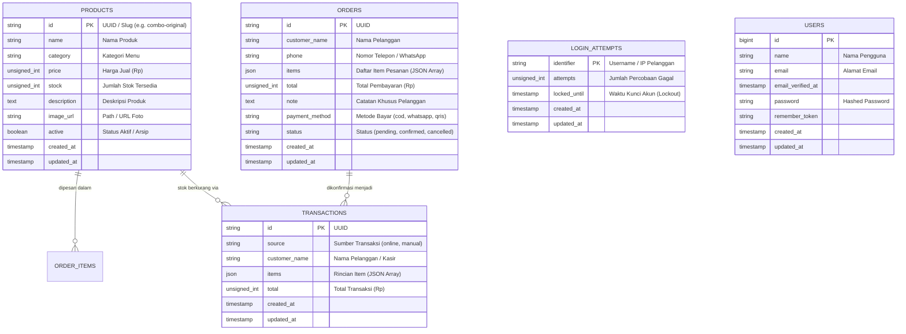

# 🗄️ Skema Basis Data (Database Schema) Sistem Ayamo

Dokumen ini mendokumentasikan skema tabel, tipe data, indeks, dan struktur entitas basis data pada sistem manajemen UMKM **Ayamo**.

---

## 1. Diagram Relasi Entitas (ERD)

---

## 2. Rincian Skema Tabel

### A. Tabel `products`
Menyimpan katalog menu makanan, paket hemat, minuman, dan stok bahan siap saji.

| Kolom | Tipe Data | Nullable | Keterangan |
| :--- | :--- | :--- | :--- |
| `id` | `VARCHAR(255)` | No | Primary Key (Slug unik atau UUID) |
| `name` | `VARCHAR(255)` | No | Nama item produk (misal: *Ayam Crispy Pedas*) |
| `category` | `VARCHAR(255)` | No | Kategori (*Ayam Goreng*, *Paket Hemat*, *Paket Keluarga*) |
| `price` | `INT UNSIGNED` | No | Harga produk dalam Rupiah |
| `stock` | `INT UNSIGNED` | No | Sisa stok barang (default: `0`) |
| `description`| `TEXT` | No | Deskripsi rasa dan isi paket |
| `image_url` | `VARCHAR(255)` | No | Path gambar lokal atau storage publik |
| `active` | `BOOLEAN` | No | `true` = tampil di etalase, `false` = diarsipkan |
| `created_at` | `TIMESTAMP` | Yes | Waktu data dibuat |
| `updated_at` | `TIMESTAMP` | Yes | Waktu data terakhir diubah |

---

### B. Tabel `orders`
Menyimpan data keranjang belanja dan checkout pesanan pelanggan dari sisi etalase online.

| Kolom | Tipe Data | Nullable | Keterangan |
| :--- | :--- | :--- | :--- |
| `id` | `VARCHAR(255)` | No | Primary Key (UUID v4) |
| `customer_name` | `VARCHAR(255)` | No | Nama lengkap pemesan |
| `phone` | `VARCHAR(255)` | No | Nomor WhatsApp/kontak pelanggan |
| `items` | `JSON` | No | Array JSON: `[{"product_id", "name", "quantity", "price"}]` |
| `total` | `INT UNSIGNED` | No | Total nominal pesanan |
| `note` | `TEXT` | Yes | Catatan tambahan (level pedas, pisah sambal, dll) |
| `payment_method`| `VARCHAR(255)` | No | Pilihan pembayaran (`whatsapp`, `cod`, `qris`) |
| `status` | `VARCHAR(255)` | No | Status order (`pending`, `confirmed`, `cancelled`) |
| `created_at` | `TIMESTAMP` | Yes | Timestamp pesanan masuk |
| `updated_at` | `TIMESTAMP` | Yes | Timestamp pembaruan status |

*Indeks Tambahan:* Index gabungan `(status, created_at)` untuk optimasi filter antrean pesanan pada dashboard admin.

---

### C. Tabel `transactions`
Menyimpan riwayat mutasi transaksi penjualan yang telah terkonfirmasi (baik dari pesanan online selesai maupun penjualan kasir manual).

| Kolom | Tipe Data | Nullable | Keterangan |
| :--- | :--- | :--- | :--- |
| `id` | `VARCHAR(255)` | No | Primary Key (UUID v4) |
| `source` | `VARCHAR(255)` | No | Sumber transaksi (`online` atau `manual`) |
| `customer_name` | `VARCHAR(255)` | No | Nama pelanggan |
| `items` | `JSON` | No | Snapshot rincian item & harga saat transaksi |
| `total` | `INT UNSIGNED` | No | Total omzet transaksi |
| `created_at` | `TIMESTAMP` | Yes | Waktu transaksi terjadi |
| `updated_at` | `TIMESTAMP` | Yes | Waktu pembaruan data |

---

### D. Tabel `login_attempts`
Mekanisme keamanan anti *brute-force* untuk panel otentikasi admin.

| Kolom | Tipe Data | Nullable | Keterangan |
| :--- | :--- | :--- | :--- |
| `identifier` | `VARCHAR(255)` | No | Primary Key (Username atau IP Address) |
| `attempts` | `INT UNSIGNED` | No | Akumulasi kesalahan input password |
| `locked_until` | `TIMESTAMP` | Yes | Waktu masa lockout berakhir |
| `created_at` | `TIMESTAMP` | Yes | Waktu pencatatan pertama |
| `updated_at` | `TIMESTAMP` | Yes | Waktu percobaan terakhir |

---

## 3. Eloquent Model Mapping

| Tabel | Eloquent Model | File Model |
| :--- | :--- | :--- |
| `products` | `App\Models\Product` | [Product.php](file:///d:/Project/2tugas/tugas-mppl/Kelompok-17/app/app/Models/Product.php) |
| `orders` | `App\Models\Order` | [Order.php](file:///d:/Project/2tugas/tugas-mppl/Kelompok-17/app/app/Models/Order.php) |
| `transactions`| `App\Models\Transaction`| [Transaction.php](file:///d:/Project/2tugas/tugas-mppl/Kelompok-17/app/app/Models/Transaction.php) |
| `login_attempts`| `App\Models\LoginAttempt`| [LoginAttempt.php](file:///d:/Project/2tugas/tugas-mppl/Kelompok-17/app/app/Models/LoginAttempt.php) |
| `users` | `App\Models\User` | [User.php](file:///d:/Project/2tugas/tugas-mppl/Kelompok-17/app/app/Models/User.php) |
