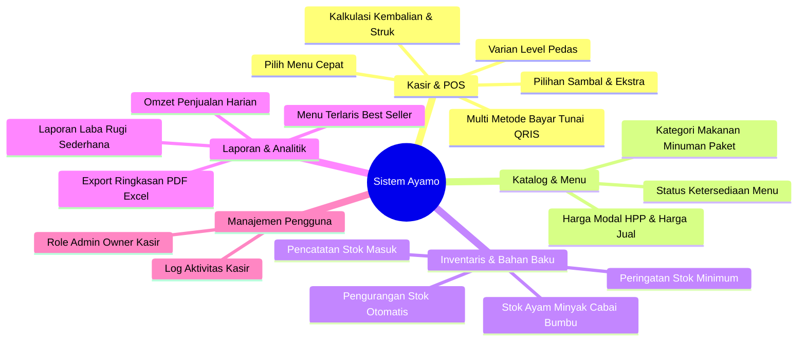

# 📦 Fitur & Modul Sistem Ayamo

Dokumen ini mendeskripsikan cakupan fungsional (*functional requirements*) dan pembagian modul sistem manajemen bisnis untuk UMKM **Ayamo (Ayam Geprek & Fried Chicken)**.

---

## 1. Ikhtisar Modul Utama

---

## 2. Rincian Modul

### A. Modul Kasir & Point of Sale (POS)
Dirancang untuk kecepatan operasional di meja kasir dengan antarmuka yang bersih dan responsif.
- **Pencarian & Filter Cepat**: Filter berdasarkan kategori menu (Paket Ayam Geprek, Ala Carte, Minuman, Ekstra Sambal).
- **Kustomisasi Pesanan**: Pemilihan level kepedasan (Level 0 - 10), pilihan sambal (Sambal Bawang, Sambal Matah, Sambal Ijo), dan add-ons (Nasi, Telur, Tahu/Tempe).
- **Billing & Pembayaran**:
  - Dukungan pembayaran Tunai (dengan hitung otomatis uang diterima dan kembalian).
  - Dukungan non-tunai (QRIS / Transfer Bank).
- **Cetak Struk**: Format cetak struk ramah printer thermal (58mm / 80mm).

### B. Modul Menu & Kategori
- **Manajemen Kategori**: Pengelompokan jenis produk.
- **Katalog Produk**: Nama, foto/thumbnail, deskripsi, harga jual, dan status stok (Tersedia / Habis).
- **Penetapan HPP (Harga Pokok Penjualan)**: Untuk memantau margin keuntungan per produk.

### C. Modul Stok & Bahan Baku (Inventory)
- **Master Bahan Baku**: Pencatatan bahan mentah (Ayam potong kg/ekor, Beras kg, Cabai rawit kg, Minyak goreng liter, Tepung, dsb.).
- **Stok Masuk (*Stock In*)**: Pencatatan pembelian bahan dari supplier beserta biayanya.
- **Pengurangan Stok Otomatis**: Integrasi pesanan kasir dengan estimasi pengurangan bahan baku utama.
- **Notifikasi Stok Menipis**: Peringatan visual jika stok berada di bawah batas minimum (*threshold*).

### D. Modul Laporan & Analitik
- **Laporan Transaksi Harian & Bulanan**: Grafik tren omzet harian, jumlah transaksi, dan rata-rata belanja (*average order value*).
- **Analisis Menu Terlaris (*Best Seller*)**: Identifikasi menu paling disukai konsumen untuk strategi promosi.
- **Laporan Kas Laci (Shift Kasir)**: Rekonsiliasi uang masuk awal shift vs akhir shift kasir.

### E. Modul Manajemen Akun & Hak Akses
- **Role Berjenjang**:
  - `Owner / Pemilik`: Akses penuh ke seluruh laporan finansial, analitik, dan pengaturan sistem.
  - `Admin / Manajer Gerai`: Akses ke menu, inventaris, dan operasional harian.
  - `Kasir`: Akses khusus ke antarmuka POS, riwayat transaksi harian, dan tutup kas shift.
